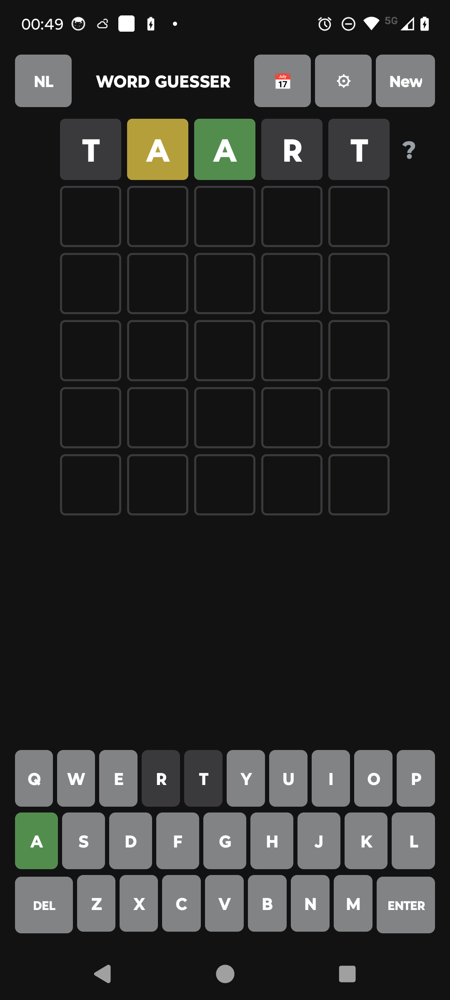

# 🟩 Word Guesser

**A tiny, native Wordle-style word game for Android** — pure Kotlin, no ads, no trackers,
~72&nbsp;KB. Guess the hidden word in six tries.

### ▶️ [**Download / F-Droid → abons.github.io/wordguesser**](https://abons.github.io/wordguesser/)

[](https://abons.github.io/wordguesser/fdroid/repo/com.hrbons.wordguesser_1.apk)
[](https://abons.github.io/wordguesser/)


<p align="center">
  
</p>

## Install

**Direct APK** — [download it](https://abons.github.io/wordguesser/fdroid/repo/com.hrbons.wordguesser_1.apk)
and open it (you may need to allow "install unknown apps" for your browser).

**Via F-Droid (recommended — gets updates automatically):** add this repository in the
[F-Droid](https://f-droid.org/) client (*Settings → Repositories → +*):

```
https://abons.github.io/wordguesser/fdroid/repo?fingerprint=C74E4BC48DBE3CCF800A859BC5A9118B23A19BA38C8B33573DBA1BDEB7E456EE
```

Then search for **Word Guesser** and install. Updates arrive automatically.

## Features

- 🟩 Classic Wordle scoring — green / yellow / gray, with correct duplicate-letter handling.
- 🌍 **Many languages** via downloadable word lists (English, Nederlands, Français, Deutsch,
  Español, and more) — fetched on demand, cached offline.
- 🔠 **Variable word length** (4–8) — the board resizes to fit.
- 🎯 **Strict mode** (reject non-words) and **hard mode** (numeric hints instead of colours).
- 📅 **Daily puzzle for every word length**, with an optional public leaderboard.
- 📈 Per-language, per-setting **statistics**.
- 🔤 Accent folding with accented display on match; language-specific extra keys (German ß,
  Nordic Æ/Ø, Polish Ł, Croatian Đ).
- ♿ TalkBack accessibility.
- 📶 **Works offline** with the built-in English list; ad-free and tracker-free.

## Why so small?

It's written in **pure Kotlin on the Android framework only** — no AppCompat, Compose,
Material, or third-party runtime libraries. The whole UI is built in code, and word lists
live online instead of being bundled. Result: a ~72&nbsp;KB APK that runs on Android 5.0+.

## Verify the download

APK SHA-256:

```
1b92ade12b437931267abd73baeba2983a9330a95bdcb4c4ddd8098fa4cef74f
```

## Privacy

No ads, no analytics, no accounts. The app only makes network calls you trigger: downloading
a word list when you pick a language, submitting a daily-puzzle score if you opt in, and word
lookup if you use it. Core play is fully offline.

## Support

If you enjoy it, you can [☕ support the developer on Ko-fi](https://ko-fi.com/hrbons).

---

*This repository hosts the public download page and a self-hosted F-Droid repository. The app
is signed by CN=hrbons. Word lists are © their respective authors and downloaded from their
own sources at runtime — none are redistributed here.*
