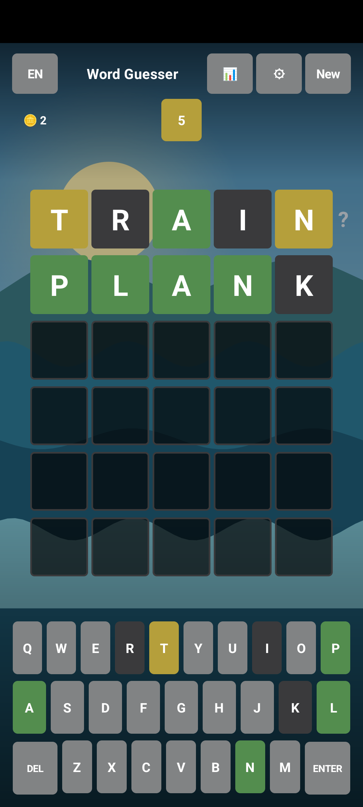

# 🟩 Word Guesser

**A tiny, native word-guessing game for Android** — pure Kotlin, no ads, no trackers,
~102&nbsp;KB. Guess the hidden word in six tries.

### ▶️ [**abons.github.io/wordguesser**](https://abons.github.io/wordguesser/)

[](https://github.com/abons/wordguesser/releases)


<p align="center">
  
</p>

## Where to get it

**Word Guesser is moving to Google Play, and there is no download here.** The APKs that used to hang
on the [releases page](https://github.com/abons/wordguesser/releases) were taken down on 2026-08-16,
and the landing page no longer serves one either. Until the Play listing is live there is no way to
install the game for the first time.

If you already have it, keep it — it works offline and nothing about it expires. One thing to know
about the move: the Play version will be signed by Google rather than by the key that signed your
copy, so it will **not** install over what you have. Getting the Play version later means removing
this one first, and your statistics and coins do not survive that.

The release notes stay as the record of what changed per version.

## Features

- 🟩 Classic letter-clue scoring — green / yellow / gray, with correct duplicate-letter handling.
- 🌍 **Many languages** via downloadable word lists (English, Nederlands, Français, Deutsch,
  Español, and more) — fetched on demand, cached offline.
- 🔠 **Variable word length** (4–8) — the board resizes to fit.
- 🎯 **Strict mode** (reject non-words) and **hard mode** (numeric hints instead of colours).
- 📅 **Daily puzzle for every word length**, with an optional public leaderboard.
- 📈 Per-language, per-setting **statistics**.
- 🔤 Accent folding with accented display on match; language-specific extra keys (German ß,
  Nordic Æ/Ø, Polish Ł, Croatian Đ).
- ♿ TalkBack accessibility.
- 📶 **Works offline** with the built-in English list; ad-free and tracker-free.

## Why so small?

It's written in **pure Kotlin on the Android framework only** — no AppCompat, Compose,
Material, or third-party runtime libraries. The whole UI is built in code, and word lists
live online instead of being bundled. Result: a ~102&nbsp;KB APK that runs on Android 5.0+.

## Verify the download

APK SHA-256 (v2.6):

```
73679ad7dce400a019a07a481b66b839f0b9fdb57367c526bc08b3d2abf63219
```

## Privacy

No ads, no analytics, no accounts. The app only makes network calls you trigger: downloading
a word list when you pick a language, submitting a daily-puzzle score if you opt in, and word
lookup if you use it. Core play is fully offline.

## Support

If you enjoy it, you can [☕ support the developer on Ko-fi](https://ko-fi.com/hrbons).

---

*This repository hosts the public download page, the APKs it links to, and the
word lists the app downloads at runtime. The app is signed by CN=hrbons. The lists are ©
their respective authors and are mirrored here as filtered derivatives, each under its own
upstream licence — see [`wordlists/SOURCES.md`](wordlists/SOURCES.md) for the full
per-language attribution and [`wordlists/licenses/`](wordlists/licenses/) for the licence
texts.*
